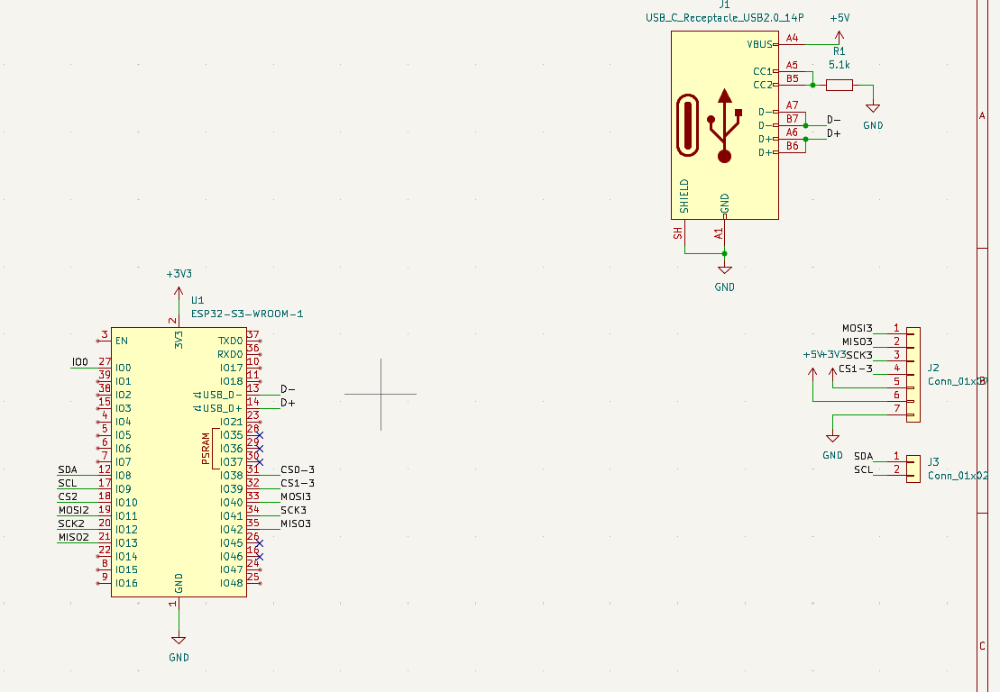
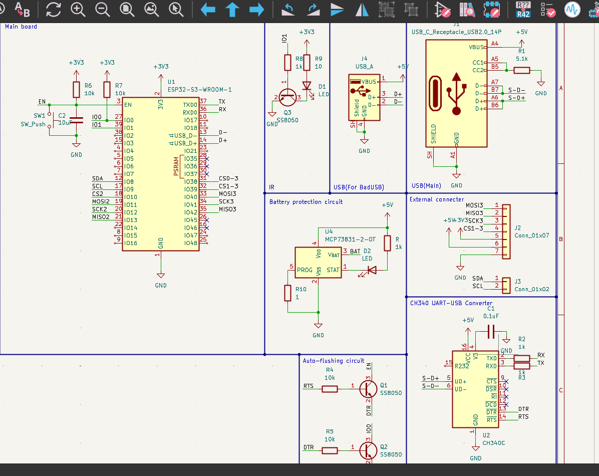

# 8/12 I drew first schematic
Today I drew up my first circuit diagram. It’s still a work in progress, but I’m making good progress, so things are looking promising.
I plan to use the ESP32-S3 microcontroller and the Bruce firmware.
  
**Total time spent: 2 hours 9 minutes**

# 8/19 I increased the number of USB ports to two, added a circuit for automatic flashing, and added a circuit (partially complete) to handle the IR sensor and battery.
This time, I increased the number of USB ports to two, added a circuit for automatic flashing, and added a circuit (partially complete) to handle the IR sensor and battery.  
The battery is particularly tricky to work with, and there isn’t much documentation available, so I’m determined to build a battery protection circuit.  
I also added the IR sensor and other components.  

  
**Total time spent: 1 hour 16 minutes**