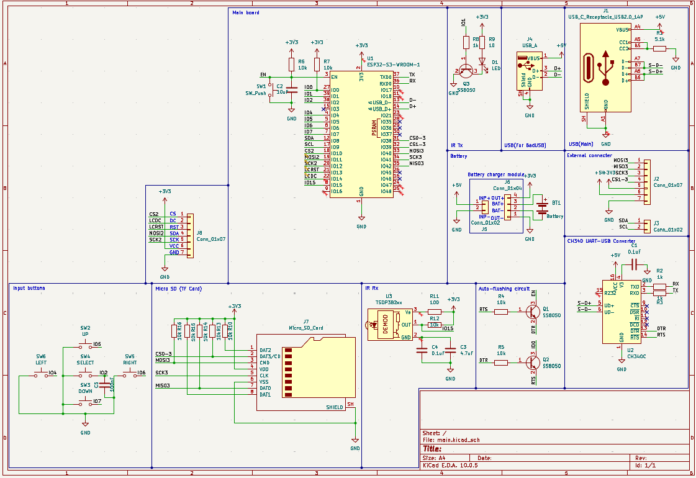

# 8/12 I drew first schematic
Today I drew up my first circuit diagram. It’s still a work in progress, but I’m making good progress, so things are looking promising.
I plan to use the ESP32-S3 microcontroller and the Bruce firmware.
  
**Total time spent: 2 hours 9 minutes**

# 8/19 I increased the number of USB ports to two, added a circuit for automatic flashing, and added a circuit (partially complete) to handle the IR sensor and battery.
This time, I increased the number of USB ports to two, added a circuit for automatic flashing, and added a circuit (partially complete) to handle the IR sensor and battery.  
The battery is particularly tricky to work with, and there isn’t much documentation available, so I’m determined to build a battery protection circuit.  
I also added the IR sensor and other components.  

  
**Total time spent: 1 hour 16 minutes**

# 8/20 Added an LCD, battery control, IR receiver, and a microSD card slot.
This time, I added an LCD, battery control, an IR receiver, and a microSD card slot.  
I decided to implement the battery control as a separate module.  
I was unsure about what size LCD to use, but I plan to install a larger one.  
Following the example of the Flipper Zero, I designed the control buttons to allow operation using four directional buttons plus a select button.  
One concern is that I added a USB Type-A connector for BadUSB, but I’m worried about how to enable users to connect that USB device.  

  
**Total time spent: 1 hour 7 minutes**  